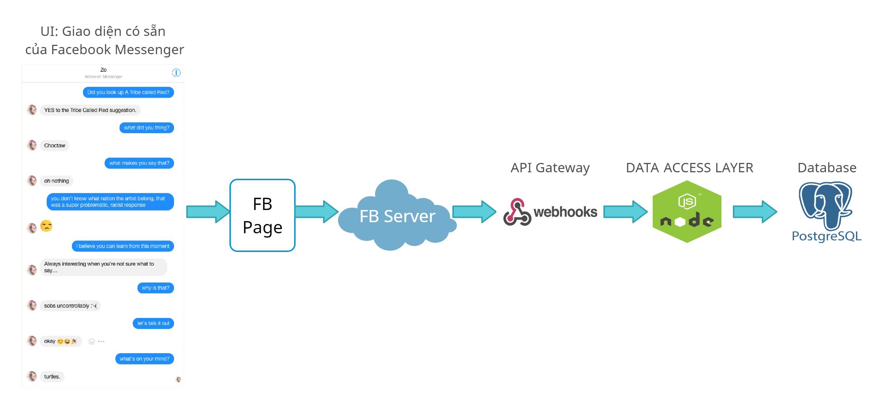

# SE04-Nhom24.2

## Thành viên trong nhóm:

### Lê Văn Hào
### Trần Thế Anh
### Nguyễn Văn Hoàn
### Vũ Ngọc Huy
### Đặng Tuấn Anh

# 1. Ý tưởng dự án
* Hiện nay nhiều người miền Trung đang gặp rất nhiều khó khăn do thiên tai gây ra và các nhà hảo tâm đang có nhu cầu giúp đỡ nhưng lại không dễ để họ có thể tiếp cận với nhau. 
* Để có thể đóng góp 1 phần công sức của mình trong việc giúp đỡ cộng đồng, chúng em quyết định làm 1 dự án có thể kết nối mọi người lại gần nhau để có thể giúp đỡ và nhận sự giúp đỡ dễ dàng hơn.
Đó là xây dựng 1 Chatbot Messenger có thể phân tích và trả lời tự động. 
* Chatbot của dự án đảm nhận module Hỗ trợ người cần cứu trợ bằng cách trò chuyện với họ, lắng nghe và ghi lại nguyện vọng, mong 
muốn của họ để sẵn sàng giúp đỡ họ.
# 2. Goals
* Xây dựng chatbot cứu trợ miền Trung - Sử dụng opensource của Facebook để dựng chatbot phân tích và trả lời tự động.

# 3. Objectives

# 4. Kiến trúc hệ thống

# 4. Công nghệ và công cụ sử dụng
## 4.1. Công nghệ
* Ngôn ngữ lập trình: 
  * JavaScript
  * Python

## 4.2. Công cụ sử dụng
* IDE Visual Studio Code
* Heroku

